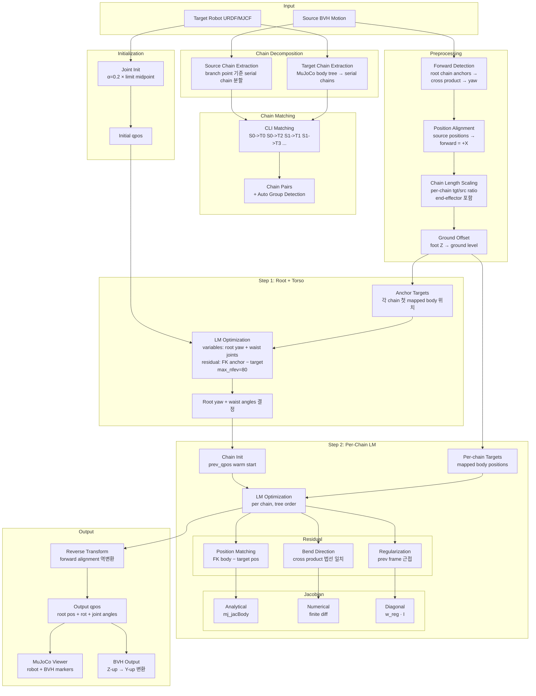
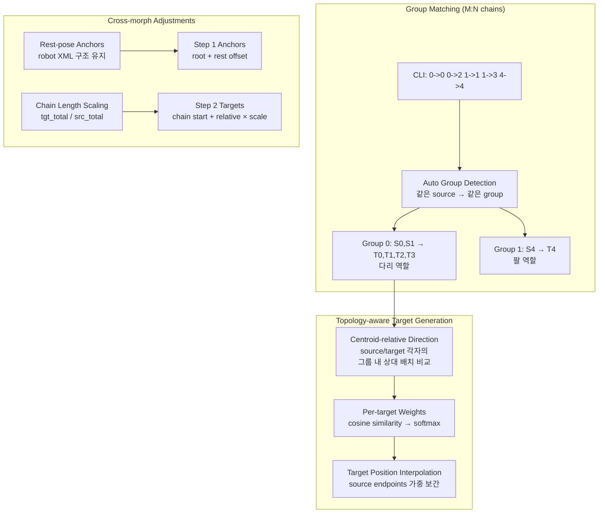
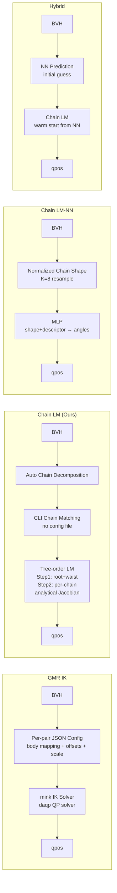

# Chain LM Retargeting Pipeline

## Full Pipeline

```mermaid
flowchart TD
    subgraph Input
        BVH[Source BVH Motion]
        URDF[Target Robot URDF/MJCF]
    end

    subgraph Chain Decomposition
        BVH --> SRC_CHAIN[Source Chain Extraction<br/>branch point 기준 serial chain 분할]
        URDF --> TGT_CHAIN[Target Chain Extraction<br/>MuJoCo body tree → serial chains]
    end

    subgraph Chain Matching
        SRC_CHAIN --> CLI[CLI Matching<br/>S0->T0 S0->T2 S1->T1 S1->T3 ...]
        TGT_CHAIN --> CLI
        CLI --> PAIRS[Chain Pairs<br/>+ Auto Group Detection]
    end

    subgraph Preprocessing
        BVH --> FWD[Forward Detection<br/>root chain anchors →<br/>cross product → yaw]
        FWD --> ALIGN[Position Alignment<br/>source positions →<br/>forward = +X]
        ALIGN --> SCALE[Chain Length Scaling<br/>per-chain tgt/src ratio<br/>end-effector 포함]
        SCALE --> GROUND[Ground Offset<br/>foot Z → ground level]
    end

    subgraph Initialization
        URDF --> INIT[Joint Init<br/>α=0.2 × limit midpoint]
        INIT --> QPOS0[Initial qpos]
    end

    subgraph "Step 1: Root + Torso"
        GROUND --> S1_TARGET[Anchor Targets<br/>각 chain 첫 mapped body 위치]
        QPOS0 --> S1_OPT[LM Optimization<br/>variables: root yaw + waist joints<br/>residual: FK anchor − target<br/>max_nfev=80]
        S1_TARGET --> S1_OPT
        S1_OPT --> S1_RESULT[Root yaw + waist angles 결정]
    end

    subgraph "Step 2: Per-Chain LM"
        S1_RESULT --> S2_INIT[Chain Init<br/>prev_qpos warm start]
        GROUND --> S2_TARGET[Per-chain Targets<br/>mapped body positions]
        S2_INIT --> S2_OPT
        S2_TARGET --> S2_OPT

        S2_OPT[LM Optimization<br/>per chain, tree order]

        subgraph Residual
            R_POS[Position Matching<br/>FK body − target pos]
            R_BEND[Bend Direction<br/>cross product 법선 일치]
            R_REG[Regularization<br/>prev frame 근접]
        end

        subgraph Jacobian
            J_POS[Analytical<br/>mj_jacBody]
            J_BEND[Numerical<br/>finite diff]
            J_REG[Diagonal<br/>w_reg · I]
        end

        S2_OPT --> R_POS
        S2_OPT --> R_BEND
        S2_OPT --> R_REG
        R_POS --> J_POS
        R_BEND --> J_BEND
        R_REG --> J_REG
    end

    subgraph Output
        S2_OPT --> REVERSE[Reverse Transform<br/>forward alignment 역변환]
        REVERSE --> QPOS[Output qpos<br/>root pos + rot + joint angles]
        QPOS --> VIZ[MuJoCo Viewer<br/>robot + BVH markers]
        QPOS --> BVH_OUT[BVH Output<br/>Z-up → Y-up 변환]
    end
```

## Cross-Morphology Extension (Group Matching)

```mermaid
flowchart TD
    subgraph "Group Matching (M:N chains)"
        INPUT[CLI: 0->0 0->2 1->1 1->3 4->4]
        INPUT --> DETECT[Auto Group Detection<br/>같은 source → 같은 group]
        DETECT --> G0[Group 0: S0,S1 → T0,T1,T2,T3<br/>다리 역할]
        DETECT --> G1[Group 1: S4 → T4<br/>팔 역할]
    end

    subgraph "Topology-aware Target Generation"
        G0 --> TOPO[Centroid-relative Direction<br/>source/target 각자의<br/>그룹 내 상대 배치 비교]
        TOPO --> WEIGHTS[Per-target Weights<br/>cosine similarity → softmax]
        WEIGHTS --> INTERP[Target Position Interpolation<br/>source endpoints 가중 보간]
    end

    subgraph "Cross-morph Adjustments"
        REST[Rest-pose Anchors<br/>robot XML 구조 유지] --> ANCHOR[Step 1 Anchors<br/>root + rest offset]
        CHAIN_SCALE[Chain Length Scaling<br/>tgt_total / src_total] --> TARGET[Step 2 Targets<br/>chain start + relative × scale]
    end
```

## Method Comparison

```mermaid
flowchart LR
    subgraph "GMR IK"
        G_IN[BVH] --> G_CFG[Per-pair JSON Config<br/>body mapping + offsets + scale]
        G_CFG --> G_IK[mink IK Solver<br/>daqp QP solver]
        G_IK --> G_OUT[qpos]
    end

    subgraph "Chain LM (Ours)"
        C_IN[BVH] --> C_CHAIN[Auto Chain Decomposition]
        C_CHAIN --> C_CLI[CLI Chain Matching<br/>no config file]
        C_CLI --> C_LM[Tree-order LM<br/>Step1: root+waist<br/>Step2: per-chain<br/>analytical Jacobian]
        C_LM --> C_OUT[qpos]
    end

    subgraph "Chain LM-NN"
        N_IN[BVH] --> N_SHAPE[Normalized Chain Shape<br/>K=8 resample]
        N_SHAPE --> N_MLP[MLP<br/>shape+descriptor → angles]
        N_MLP --> N_OUT[qpos]
    end

    subgraph "Hybrid"
        H_IN[BVH] --> H_NN[NN Prediction<br/>initial guess]
        H_NN --> H_LM[Chain LM<br/>warm start from NN]
        H_LM --> H_OUT[qpos]
    end
```